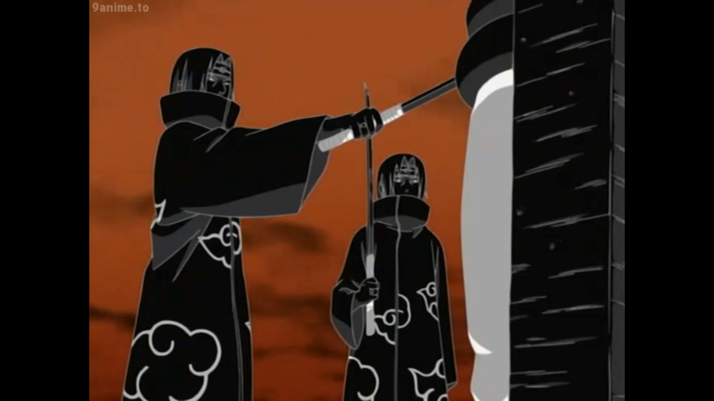
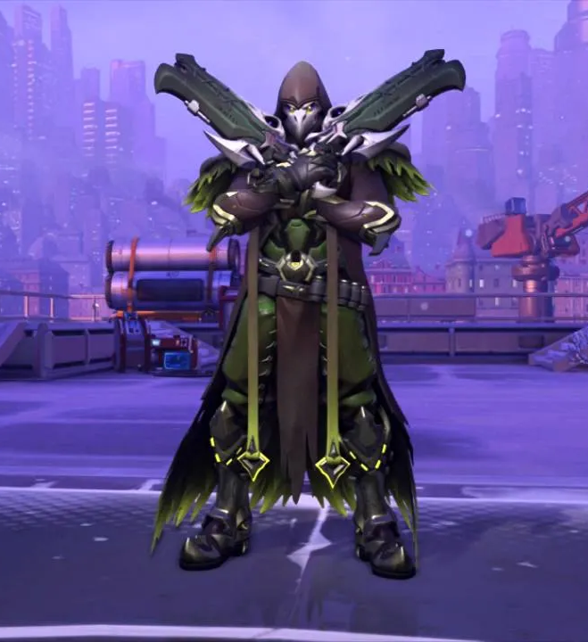

# Bosses

# Shadow Man

In this world, every time a character rolls a nat 1 on any attack roll (or could apply to any d20 roll) a dark, ghoulish humanoid apparition ascends from ‘beneath’ within arms reach of the character and stabs them in the torso with a dagger without breaking eye contact with the character. Completely silent, expressionless, and unstoppable. After stabbing, the apparition descends back ‘beneath’ and disappears until somebody else meets the conditions.

### Image Inspiriation

