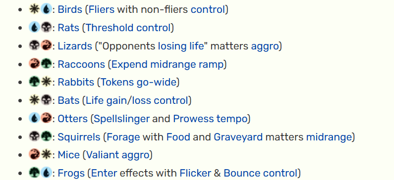

# Kingdoms

There are 5 Kingdoms in Faunria and the Capitol land which is where the King of Kings live (like the Crownlands and how it holds King’s Landing)

The 5 Kingdoms have dominant species that relates to the colors of the creatures inspired from MTG:

[Ringwatch](Kingdoms/Ringwatch%20305e090bea488074ab07e6ab8eedaab9.md)

[The Riverbends](Kingdoms/The%20Riverbends%20305e090bea488013af65d1339a428d52.md)

[Stonewood](Kingdoms/Stonewood%20305e090bea4880b287baebbc02f6f56f.md)

[Logjam](Kingdoms/Logjam%20305e090bea4880949a26d79853c156cd.md)

[The Pools](Kingdoms/The%20Pools%20305e090bea4880d49c50e05efb15e81a.md)