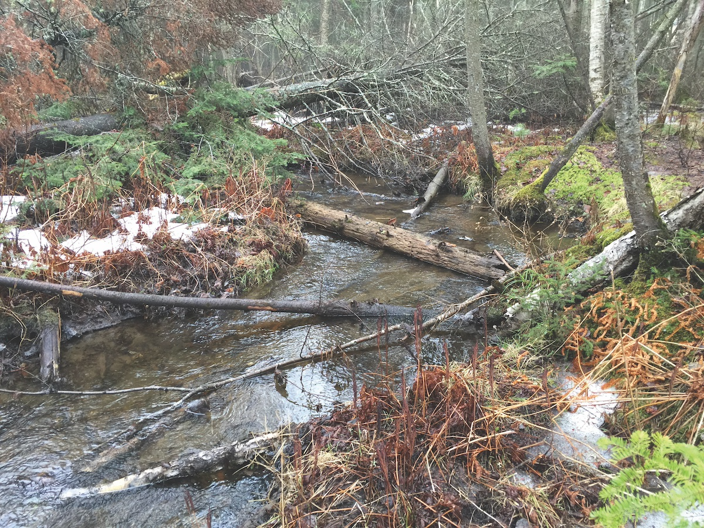
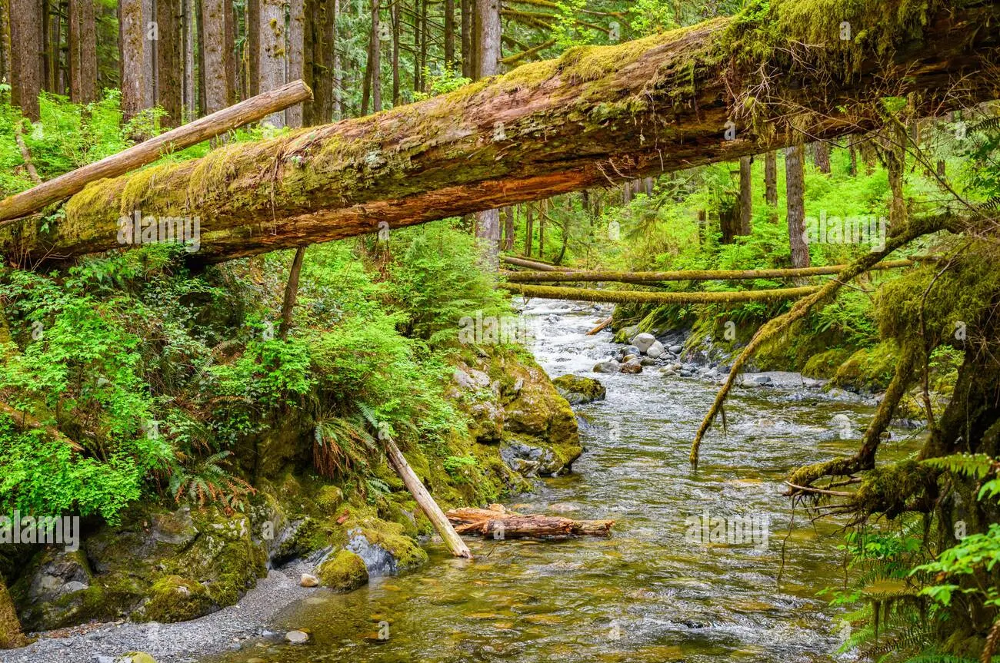
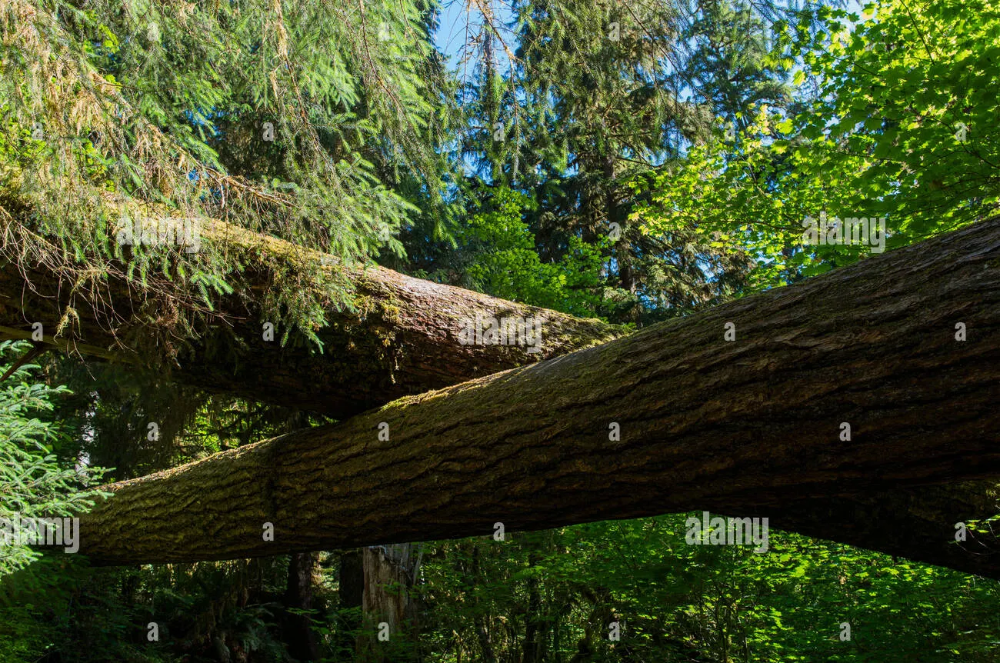

# Logjam

# Main Inhabitants

Lizards, Raccoons, Otters, Mice

# Geography

**Creek-fed hardwood forest with fallen logs, beaver ponds, and snag piles.**  

Otters use the creek/pond network, raccoons forage along the water and in trees, lizards use sunlit logs/rocky banks, and mice use the thick ground cover and deadwood.

# Capital

**Meakcreak:** located where two clear creeks meet a beaver-pond chain. Raccoon market docks sit on the pond edge, otter lodges guard the waterways, and lizard watchposts occupy sunlit logjams and stone bars.

## Capital Design

### Descriptive Features

- Contains Greatlog Castle: a giant, hollowed-out tree where there’s only one way in, and one way out. The Castle is angled at a 30 degree angle, where the throne is at the highest point in the castle.
- Different masses of land in a creek system
- lots of trees, but lizards still find sun spots (aka “shinies”) to bask in
- otters use the creeks for easy transportation
- raccoons have several trade ports to sell goods
- mice live in wooden houses

### Image Inspiration

The beaverfolk built these oak bridges to pass the creeks. It was one of the species’s greatest feats

Greatlog Castle

Riverwood

# Lore

Meakcreak was home to the Architects, but after they went extinct, it is now occupied by the animalfolk of Faunria. Contains Greatlog castle, a castle known to be impenetrable. Because of the nature of the log, there was only one way in, and one way out. The beaver king sat at the top of the castle, with guards lined up the entire way down. Siege was impossible due to the surrounding water and increasing elevation. Nonetheless, Greatlog Castle fell after the beaverfolk’s extinction. Many towns and folk have different stories on how the beaverfolk came to end, but one thing is certain: the beavers were the early architects of Faunria, and their work and history is seen everywhere.