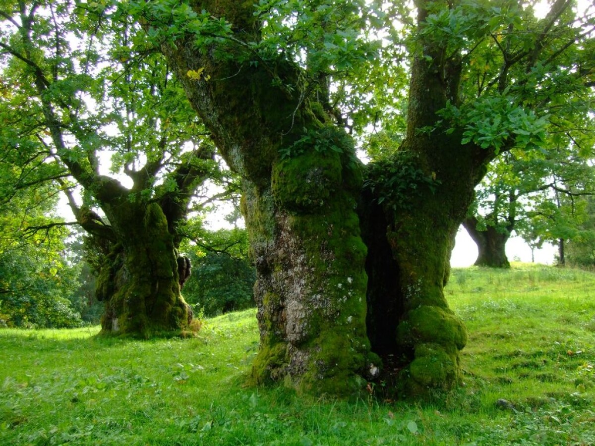

# Ringwatch

# Main Inhabitants

Birds, Rabbits, Bats, Mice

# Geography

**Old-growth mixed woodland with meadow edges and hollow-tree roosts.**  

A mature forest provides canopy nesting for birds, hollow trunks/caves for bats, and dense underbrush plus grassy clearings for rabbits and mice.

# Capital

[Greatring](Ringwatch/Greatring%2033de090bea4880d3a480da30a69ad494.md)

**Greatring:** a ring of colossal, hollow oaks around a wildflower meadow. Homes and halls are carved into living trunks, with bat-roost belfries in the highest hollows and rabbit burrows forming the “lower streets” under the roots.

## Capital Design

### Descriptive Features

- a ring of tall, wide oak trees functions as the border wall
- bats live high on top/ inside of the trees
- rabbits live in burrows under the roots
- birds also live on higher levels of the trees
- mice live on the open surface clearing

### Image Inspiration

