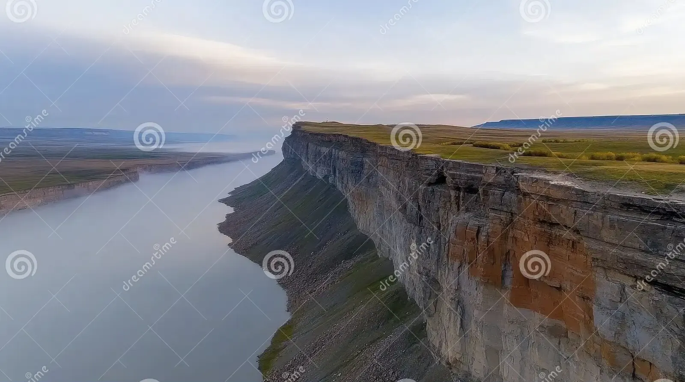

# Stonewood

# Main Inhabitants

Rats, Lizards, Bats, Squirrels

# Geography

**Rocky woodland escarpment with warm stone outcrops and caves.**  

Rats use crevices and burrows, lizards bask and hunt on sunlit rocks/logs, bats roost in caves and fissures, and squirrels thrive in the surrounding nut-bearing forest.

# Capital

**Weepwall:** a cliffside capital built into a stepped basalt face. Squirrel rope-bridges link ledges and tree platforms, lizard sun-terraces line the outer walls, and the “Night Galleries” are deep caverns that open into bat-roost cathedrals.

## Capital Design

### Descriptive Features

- city on a high cliff
- bats live in caves in the side of the cliff
- lizards live in/around/under rocks
- rats live on surface and shallow underground burrows
- squirrels live in the trees, but there aren’t many trees bc of elevation. rope bridges link the tree platforms (think Endor)

### Image Inspiration

El Capitan

El Capitan

El Capitan

El Capitan

El Capitan

Weeping Wall

Weeping Wall Frozen

Endor

[Rivendell](https://static.wikia.nocookie.net/lotr/images/7/70/Jerry_Vanderstelt_-_Rivendell.jpg/revision/latest?cb=20180501204919)

Rivendell